# User Flow Diagrams Reference

> Mermaid diagrams for common Staylook user flows

---

## Authentication Flows

### Login Flow

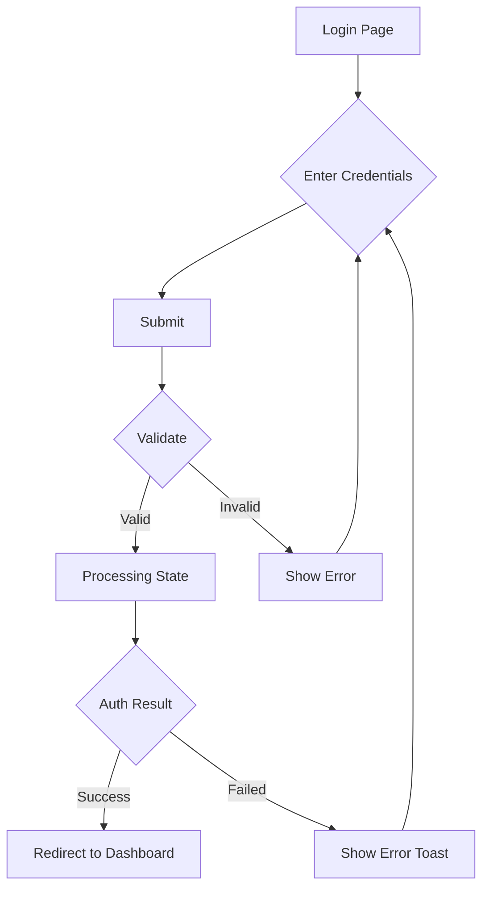

### Registration Flow

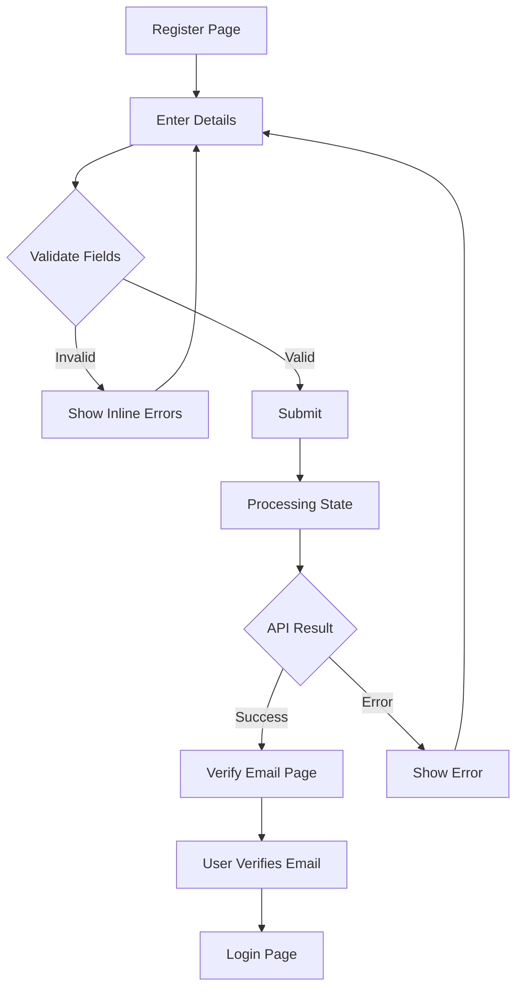

### Password Reset Flow

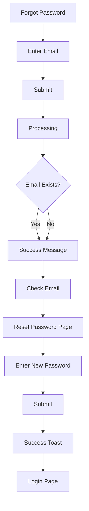

---

## CRUD Flows

### Create Item Flow

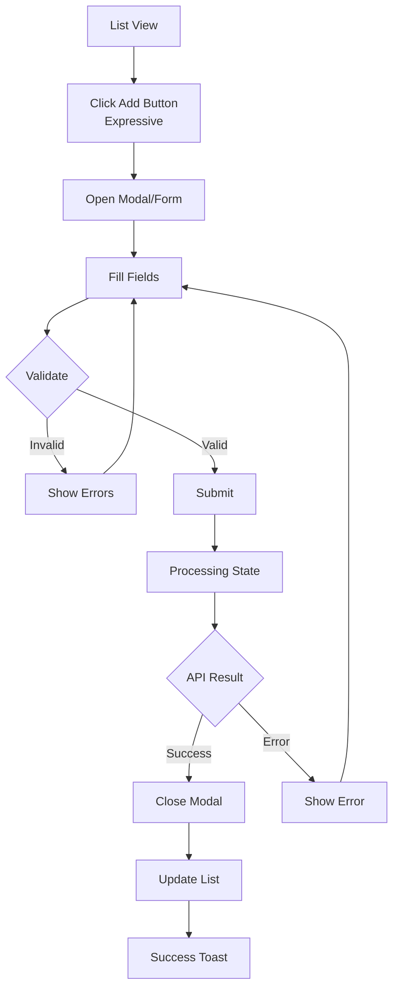

### Edit Item Flow

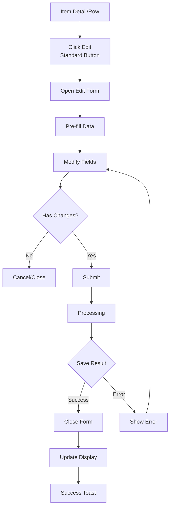

### Delete Item Flow

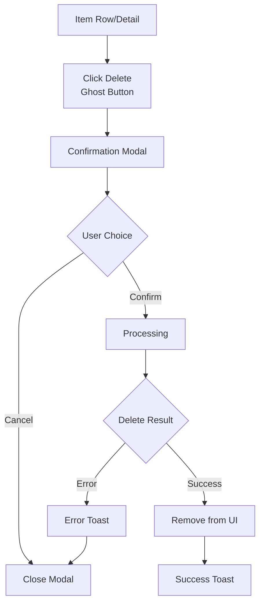

---

## Wizard/Multi-Step Flows

### Onboarding Wizard

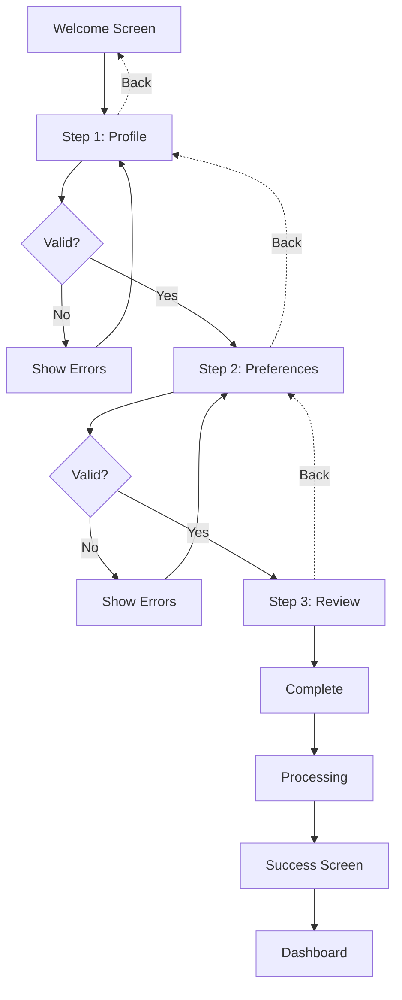

### Checkout Wizard

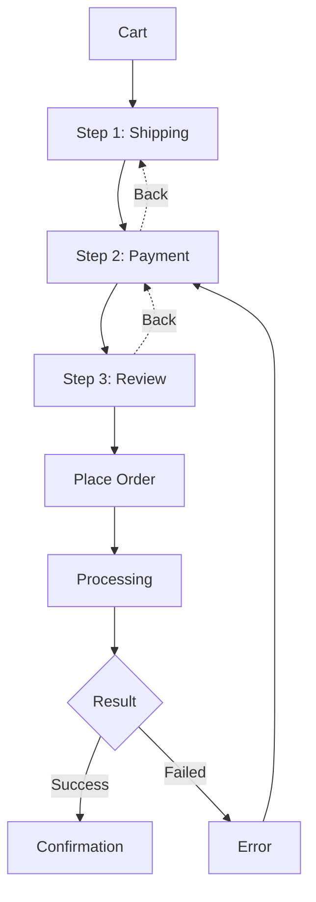

---

## Search & Filter Flow

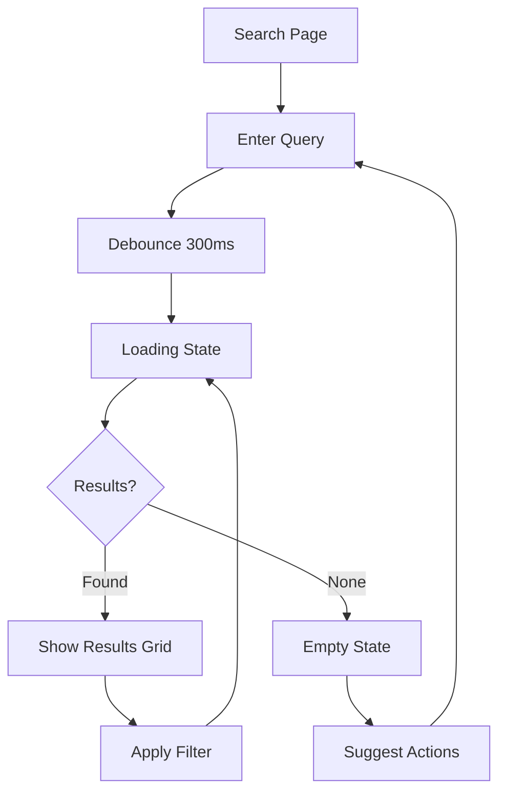

---

## Form Submission States

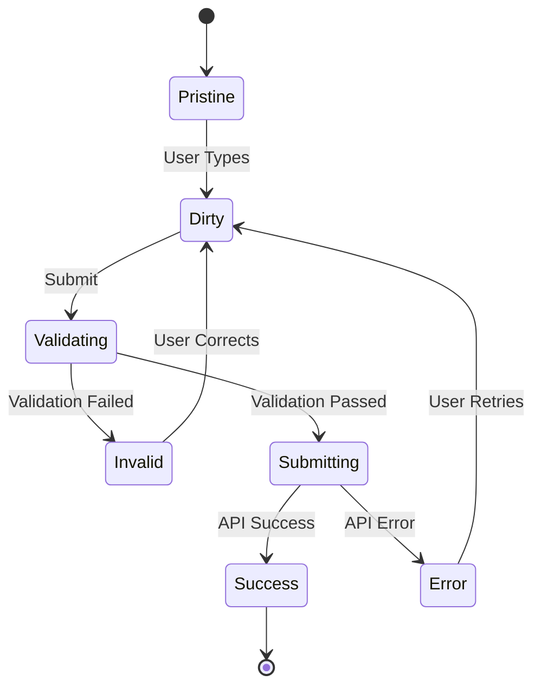

---

## Navigation Guards

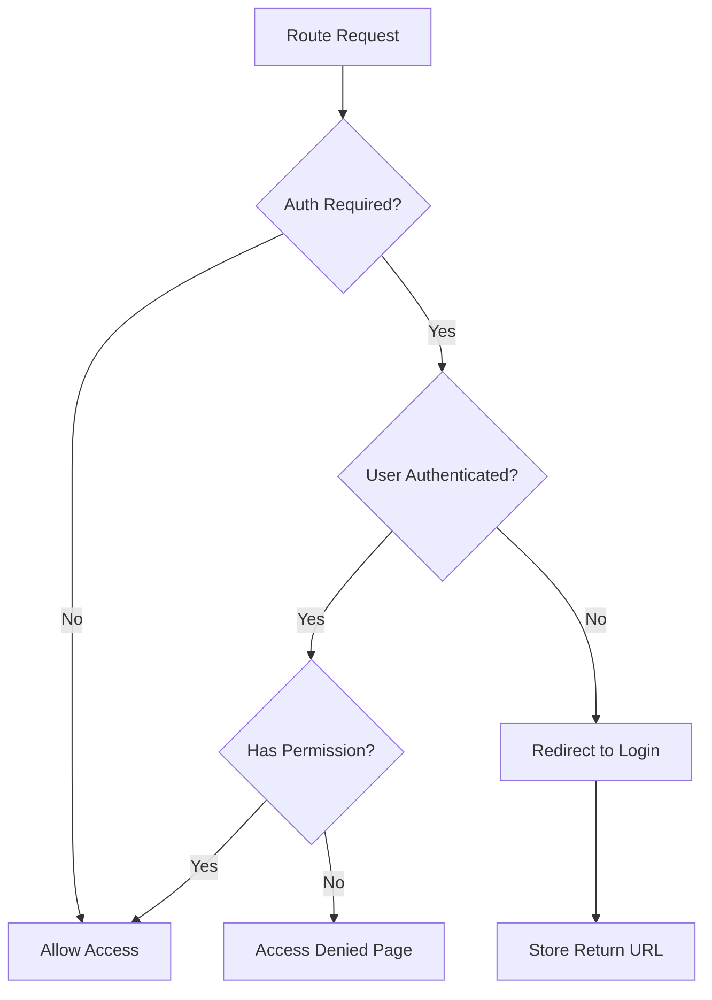

---

*Flow Diagrams — Staylook UX Reference*
