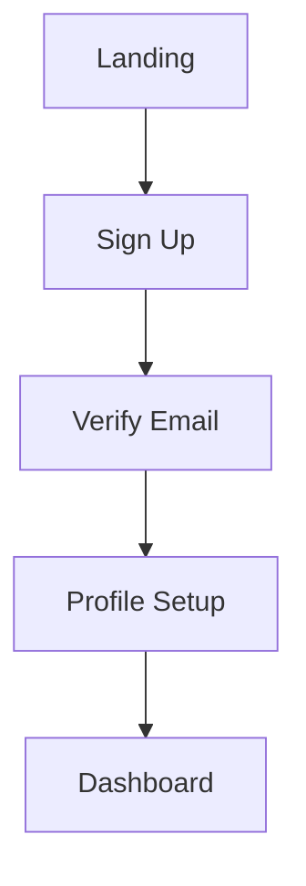

# Journey to Screens Skill

## What is it?

This skill converts user journey Mermaid diagrams into detailed frontend screen specifications, enabling direct implementation of pages and components.

## Why use it?

- **Direct Translation**: Journey → Screens → Code
- **Completeness**: Every journey step becomes a screen
- **Consistency**: Standardized screen specs
- **Speed**: Faster development with clear specs
- **Quality**: No missing screens or states

---

## Journey to Screen Conversion

### Input: Journey Diagram



### Output: Screen Specifications

For each node in the journey, generate:

```markdown
## Screen: [Node Name]

### Metadata
- **Route**: `/path`
- **Title**: Page Title
- **Auth Required**: Yes/No

### Layout
- **Template**: AuthLayout / DashboardLayout / FullWidthLayout
- **Max Width**: sm / md / lg / xl / full

### Components Required
| Component | Props | Purpose |
|-----------|-------|---------|
| Header | title, back | Navigation |
| Form | fields[], onSubmit | Data entry |
| Button | label, variant | Actions |

### Data Requirements
| Data | Source | When |
|------|--------|------|
| user | API /me | on mount |
| formData | local state | on input |

### Actions
| Action | Trigger | Result |
|--------|---------|--------|
| Submit | Button click | Navigate to next |
| Cancel | Back button | Navigate to previous |

### States
| State | UI | Components |
|-------|-----|------------|
| Loading | Skeleton | PageSkeleton |
| Error | Alert | ErrorAlert |
| Success | Redirect | - |
```

---

## Screen Specification Template

```typescript
interface ScreenSpec {
  // Identification
  id: string;
  name: string;
  route: string;
  
  // Journey Context
  journeyStep: number;
  previousScreen: string | null;
  nextScreens: string[];
  
  // Layout
  layout: 'auth' | 'dashboard' | 'fullWidth' | 'marketing';
  maxWidth: 'sm' | 'md' | 'lg' | 'xl' | 'full';
  
  // Auth
  authRequired: boolean;
  roles?: string[];
  
  // Data
  dataRequirements: {
    name: string;
    source: 'api' | 'state' | 'params' | 'query';
    endpoint?: string;
    required: boolean;
  }[];
  
  // Components
  components: {
    name: string;
    location: 'header' | 'main' | 'footer' | 'sidebar';
    props: Record<string, any>;
  }[];
  
  // Actions
  actions: {
    name: string;
    trigger: string;
    handler: 'navigate' | 'api' | 'modal' | 'state';
    destination?: string;
  }[];
  
  // States
  states: {
    loading: { component: string };
    error: { component: string };
    empty?: { component: string };
    success?: { action: string };
  };
}
```

---

## Example: Onboarding Journey → Screens

### Journey:
```
Landing → Sign Up → Verify → Profile → Dashboard
```

### Screen 1: Landing

```markdown
## Screen: Landing Page

**Route**: `/`
**Auth**: Not required
**Layout**: MarketingLayout

### Components
- HeroSection: headline, subtext, ctaButton
- FeatureGrid: features[]
- TestimonialSlider: testimonials[]
- CTASection: title, button

### Actions
| Action | Trigger | Result |
|--------|---------|--------|
| Sign Up | CTA click | Navigate → /signup |
| Login | Nav link | Navigate → /login |

### States
- Default: Show all sections
- No loading/error (static page)
```

### Screen 2: Sign Up

```markdown
## Screen: Sign Up

**Route**: `/signup`
**Auth**: Must NOT be logged in (redirect if auth)
**Layout**: AuthLayout (centered card)

### Components
- Card: Contains form
- Form: email, password, confirmPassword
- Button: "Create Account"
- Link: "Already have account? Login"

### Validation
| Field | Rules |
|-------|-------|
| email | required, valid email |
| password | required, min 8 chars |
| confirmPassword | matches password |

### Actions
| Action | Trigger | Result |
|--------|---------|--------|
| Submit | Form submit | POST /api/auth/signup |
| Login | Link click | Navigate → /login |

### States
| State | UI |
|-------|-----|
| Idle | Form visible |
| Submitting | Button loading |
| Error | Error alert above form |
| Success | Navigate → /verify |
```

### Screen 3: Verify Email

```markdown
## Screen: Email Verification

**Route**: `/verify`
**Auth**: Partial (email registered, not verified)
**Layout**: AuthLayout

### Components
- Card: Verification content
- OTPInput: 6 digits
- Button: "Verify"
- Button: "Resend Code" (variant ghost)

### Data
| Data | Source |
|------|--------|
| email | Query param or session |

### Actions
| Action | Trigger | Result |
|--------|---------|--------|
| Verify | Submit code | POST /api/auth/verify |
| Resend | Button click | POST /api/auth/resend |

### States
| State | UI |
|-------|-----|
| Idle | OTP input visible |
| Verifying | Button loading |
| Resending | Resend button loading |
| Error | Error message below input |
| Success | Navigate → /profile-setup |
```

---

## Component Mapping Table

Map journey actions to UI components:

| Journey Action | Component Pattern |
|----------------|-------------------|
| View data | DataTable, CardGrid, List |
| Create item | Form in Dialog or Page |
| Edit item | Form with existing data |
| Delete item | ConfirmDialog |
| Navigate | Link, Button with router |
| Submit | Form with Button |
| Select option | Select, RadioGroup |
| Toggle setting | Switch, Checkbox |
| Upload file | FileUpload, ImageUpload |
| Search | SearchInput, Filters |

---

## Generated File Structure

For each screen, generate:

```
src/
├── pages/
│   └── [feature]/
│       ├── index.tsx          # List/Landing
│       ├── [id]/
│       │   └── index.tsx      # Detail view
│       ├── new.tsx            # Create form
│       └── [id]/edit.tsx      # Edit form
│
├── components/
│   └── [feature]/
│       ├── FeatureCard.tsx
│       ├── FeatureForm.tsx
│       ├── FeatureList.tsx
│       └── FeatureFilters.tsx
```

---

## Best Practices

✅ **DO**:
- Generate spec for every journey node
- Include all states (loading, error, empty)
- Define clear navigation paths
- Specify auth requirements
- List all required components

❌ **DON'T**:
- Skip edge case screens
- Forget validation rules
- Leave actions undefined
- Mix concerns in single screen
- Ignore mobile responsiveness
