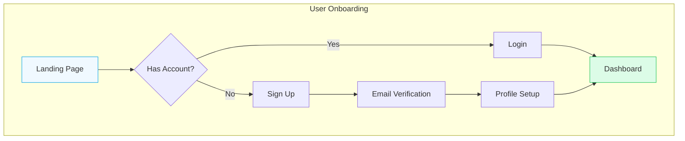
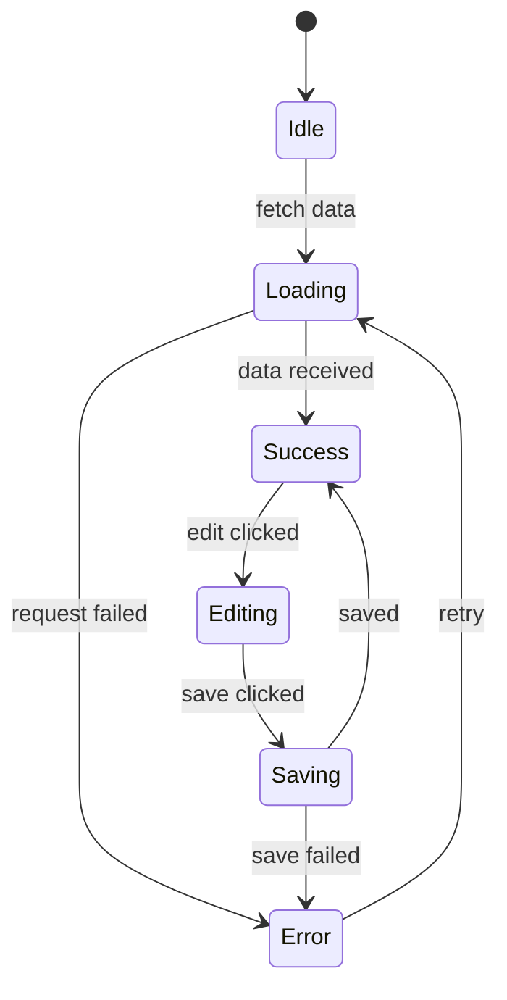
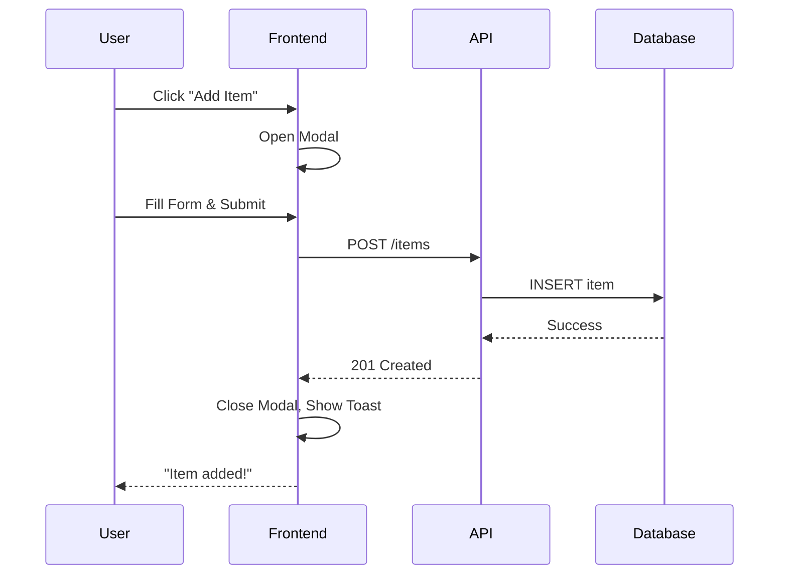
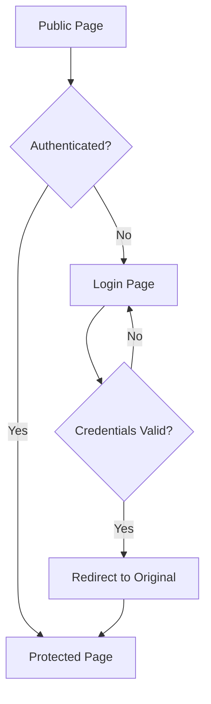
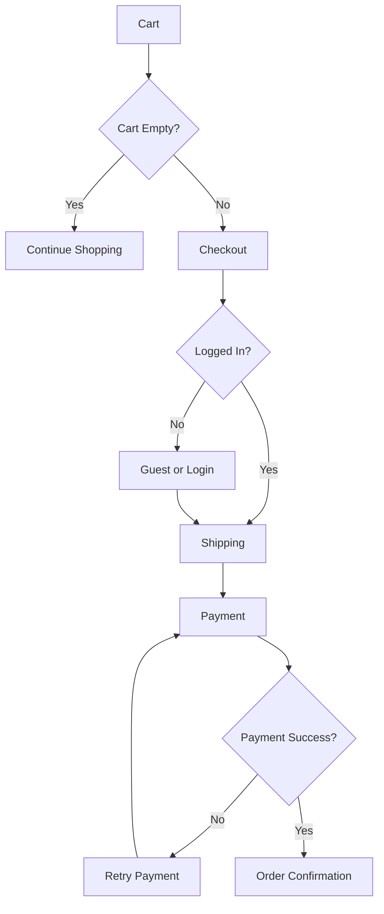
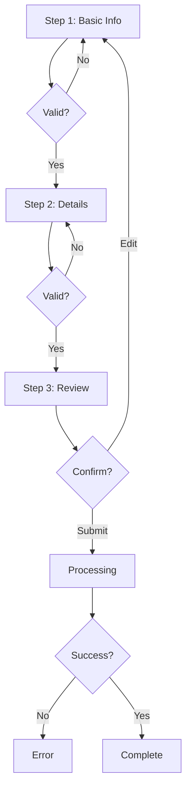
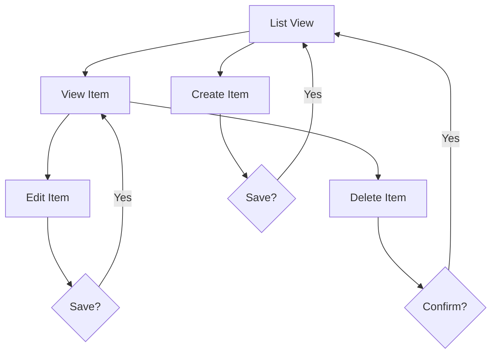

# User Journey Mapping Skill

## What is it?

This skill documents complete end-to-end user journeys using Mermaid diagrams, providing a visual blueprint that maps directly to frontend implementation.

## Why use it?

- **Clarity**: Visualize entire user flow before coding
- **Completeness**: Catch missing screens/states early
- **Communication**: Share flows with team/stakeholders
- **Planning**: Know exactly what to build
- **Testing**: Define test scenarios from flows

---

## Journey Diagram Types

### 1. Flowchart (Main User Path)



### 2. State Diagram (Screen States)



### 3. Sequence Diagram (User Interactions)



---

## Journey Documentation Template

### Feature: Feature Name

```markdown
## User Journey: [Journey Name]

### Overview
Brief description of what user accomplishes.

### Actors
- Primary: End User
- Secondary: Admin (if applicable)

### Entry Points
- Direct URL: `/feature`
- Navigation: Dashboard → Feature Link
- Deep Link: Email notification

### Journey Flow

[Mermaid flowchart here]

### Screen Inventory

| Step | Screen | Route | Components |
|------|--------|-------|------------|
| 1 | Landing | `/feature` | Hero, CTAButton |
| 2 | Form | `/feature/new` | Form, Input, Button |
| 3 | Success | `/feature/success` | SuccessCard |

### Data Requirements

| Screen | Input Data | Output Data | API Calls |
|--------|------------|-------------|-----------|
| Form | user input | formData | POST /api/items |
| Success | itemId | item details | GET /api/items/:id |

### Edge Cases
- [ ] User cancels mid-flow
- [ ] Validation errors
- [ ] Network failure
- [ ] Session timeout
```

---

## Common Journey Patterns

### Authentication Flow



### E-commerce Checkout Flow



### Form Wizard Flow



### CRUD Flow



---

## Screen Mapping Table

For each journey, create a mapping table:

```markdown
| Journey Step | Screen Name | Route | Entry Action | Exit Actions | Components |
|--------------|-------------|-------|--------------|--------------|------------|
| Start | Home | `/` | Page load | Click CTA | Hero, Nav |
| Sign Up | Register | `/register` | Click "Sign Up" | Submit form, Cancel | Form, Input |
| Verify | Verification | `/verify` | Form submit | Enter code, Resend | OTPInput |
| Complete | Dashboard | `/dashboard` | Verification success | - | DashboardLayout |
```

---

## Best Practices

✅ **DO**:
- Start with happy path, then add error branches
- Include all entry points (direct, deep links)
- Document data needs per screen
- Mark decision points clearly
- Use consistent naming

❌ **DON'T**:
- Skip edge cases (errors, cancellation)
- Forget authentication gates
- Ignore mobile-specific flows
- Leave screens unnamed
- Mix different journeys in one diagram
