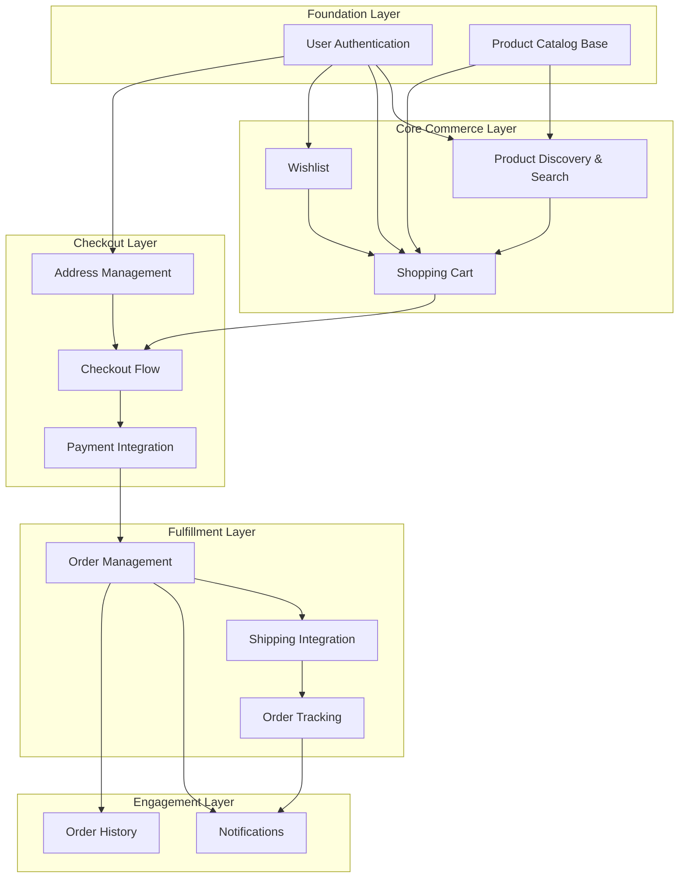

# 📘 Product Requirements Document (PRD)

**Version:** `1.1` | **Status:** `Decision-Complete`

## Table of Contents

1. Document Information
2. Governance & Workflow Gates
3. Feature Index (Living Blueprints)
4. Product Vision
5. Core Business Problem
6. Target Personas & Primary Use Cases
7. Business Value & Expected Outcomes
8. Success Metrics / KPIs
9. Ubiquitous Language (Glossary)
10. Architectural Overview (DDD – Mandatory)
11. Event Taxonomy Summary
12. Design System Strategy (MCP)
13. Feature Execution Flow
14. Repository Structure & File Standards
15. Feature Blueprint Standard (Stories & Gherkin Scenarios)
16. Traceability & Compliance Matrix
17. Non-Functional Requirements (NFRs)
18. Observability & Analytics Integration
19. Feature Flags Policy (Mandatory)
20. Security & Compliance
21. Risks / Assumptions / Constraints
22. Out of Scope
23. Product Decisions (Resolved)
24. Rollout & Progressive Delivery
25. Appendix

---

## 1. Document Information

| Field              | Details                                           |
| ------------------ | ------------------------------------------------- |
| **Document Title** | itsme.fashion Strategic PRD                       |
| **File Location**  | `docs/product/PRD.md`                             |
| **Version**        | `1.1`                                             |
| **Date**           | `2025-12-31`                                      |
| **Author(s)**      | Planning Agent                                    |
| **Stakeholders**   | Product Owner, Engineering Lead, Design Lead     |

---

## 2. Governance & Workflow Gates

Delivery is enforced through **explicit workflow gates**.
Execution may be human-driven, agent-driven, or hybrid.

| Gate | Name                    | Owner                | Preconditions                             | Exit Criteria            |
| ---- | ----------------------- | -------------------- | ----------------------------------------- | ------------------------ |
| 1    | Strategic Alignment     | Product Architecture | Vision, context map defined               | Approval recorded        |
| 2    | Blueprint Bootstrapping | Planning Function    | Feature issues created, blueprints linked | Blueprint complete       |
| 3    | Technical Planning      | Engineering          | DDD mapping, flags defined                | Ready for implementation |
| 4    | Implementation          | Engineering          | Code + tests                              | CI green                 |
| 5    | Review                  | Engineering          | Preview deployed                          | Acceptance approved      |
| 6    | Release                 | Product / Ops        | All checks passed                         | Production approved      |

---

## 3. Feature Index (Living Blueprints)

| Feature ID | Title                      | GitHub Issue | Blueprint Path                               | Status  |
| ---------- | -------------------------- | ------------ | -------------------------------------------- | ------- |
| TBD        | User Authentication        | TBD          | `docs/features/identity/authentication.md`   | Draft   |
| TBD        | Product Catalog            | TBD          | `docs/features/catalog/product-catalog.md`   | Draft   |
| TBD        | Shopping Cart              | TBD          | `docs/features/ordering/shopping-cart.md`    | Draft   |
| TBD        | Checkout & Payment         | TBD          | `docs/features/ordering/checkout.md`         | Draft   |
| TBD        | Order Management           | TBD          | `docs/features/ordering/order-management.md` | Draft   |
| TBD        | Wishlist                   | TBD          | `docs/features/catalog/wishlist.md`          | Draft   |

---

## 4. Product Vision

> **Empower people to express their uniqueness with premium, clean, and cruelty-free beauty products delivered through a fast, trustworthy, and elegant shopping experience.**

itsme.fashion is a modern, user-friendly ecommerce platform offering premium beauty products—including cosmetics, skin care, and hair care—that emphasize natural ingredients, ethical manufacturing, and a bold, empowering brand tone.

### Strategic Differentiators

- **Clean Beauty Focus**: All products feature natural ingredients, no parabens, cruelty-free certification
- **Ethical Brand Identity**: Sustainable beauty with transparent sourcing
- **Premium Experience**: Fast, trustworthy, elegant shopping journey
- **Indian Market First**: Localized payment (Cashfree) and shipping (Shiprocket) integrations

---

## 5. Core Business Problem

### Primary Problem

Consumers seeking premium, ethical beauty products face fragmented shopping experiences with:
- Difficulty verifying product authenticity and ethical claims
- Poor mobile experiences on existing platforms
- Limited trust in product ingredients and sourcing
- Complicated checkout processes with unreliable payment options

### Solution Approach

A purpose-built ecommerce platform that:
1. **Curates** premium beauty products with verified ethical credentials
2. **Delivers** a mobile-first, fast shopping experience
3. **Provides** transparent ingredient information and ethical markers
4. **Integrates** reliable local payment and shipping options
5. **Builds** customer trust through order tracking and notifications

---

## 6. Target Personas & Primary Use Cases

| Persona                  | Description                                                                 | Goals                                                    | Key Use Cases                                           |
| ------------------------ | --------------------------------------------------------------------------- | -------------------------------------------------------- | ------------------------------------------------------- |
| **Conscious Beauty Buyer** | Health-conscious consumers (25-45) seeking clean, ethical beauty products | Find verified cruelty-free products, understand ingredients | Browse catalog, check ethical badges, read ingredients |
| **Repeat Purchaser**      | Loyal customers who regularly restock favorite products                    | Quick reorder, track deliveries, manage preferences       | Wishlist management, order history, quick checkout      |
| **Gift Shopper**          | Users purchasing beauty products as gifts                                  | Discover popular items, reliable delivery                 | Product discovery, category browsing, shipping options  |
| **Mobile-First Shopper**  | Users primarily shopping via mobile devices                                | Seamless mobile experience, easy payment                  | Mobile browsing, mobile checkout, order tracking        |

---

## 7. Business Value & Expected Outcomes

| Outcome                      | Description                                                | KPI Alignment | Priority |
| ---------------------------- | ---------------------------------------------------------- | ------------- | -------- |
| Customer Acquisition         | Attract conscious beauty consumers through ethical positioning | KPI-001       | High     |
| Conversion Optimization      | Streamlined checkout reduces cart abandonment              | KPI-002       | High     |
| Customer Retention           | Wishlist and order tracking increase repeat purchases      | KPI-003       | High     |
| Operational Efficiency       | Automated order processing and shipping integration        | KPI-004       | Medium   |
| Brand Trust                  | Transparent product information builds customer confidence | KPI-005       | High     |

---

## 8. Success Metrics / KPIs

| KPI ID  | Name                    | Definition                                      | Baseline | Target | Source    |
| ------- | ----------------------- | ----------------------------------------------- | -------- | ------ | --------- |
| KPI-001 | Monthly Active Users    | Unique users per month                          | 0        | 10,000 | GA4       |
| KPI-002 | Conversion Rate         | Orders / Sessions                               | 0%       | 3%     | GA4       |
| KPI-003 | Repeat Purchase Rate    | Returning customers / Total customers           | 0%       | 25%    | Firestore |
| KPI-004 | Cart Abandonment Rate   | Abandoned carts / Total carts                   | N/A      | <70%   | GA4       |
| KPI-005 | Order Fulfillment Time  | Avg time from order to shipment                 | N/A      | <24h   | OTEL      |
| KPI-006 | Customer Satisfaction   | Post-purchase survey score                      | N/A      | >4.5   | Survey    |

---

## 9. Ubiquitous Language (Glossary)

All domain terms **must be defined once and reused consistently**.

* **Product** — A sellable beauty item with SKU, price, description, and ethical markers
* **Cart** — A temporary collection of products a customer intends to purchase
* **Order** — A confirmed purchase with payment and shipping details
* **Wishlist** — A saved collection of products for future purchase consideration
* **Ethical Marker** — A verified badge (cruelty-free, paraben-free, vegan) on a product
* **Checkout** — The process of converting a cart to an order with payment
* **Shipment** — The physical delivery of an order via carrier
* **Customer** — A registered user who can place orders
* **Guest** — An unregistered user who can complete purchases without registration; account creation offered post-purchase
* **Anonymous Cart** — A cart stored in local storage for unauthenticated users, synced to server upon authentication
* **Category** — A product classification (Skin Care, Hair Care, Cosmetics)
* **Bounded Context** — A DDD boundary defining a domain's scope and language
* **Aggregate** — A cluster of domain objects treated as a single unit

---

## 10. Architectural Overview (DDD — Mandatory)

### Bounded Contexts

| Context      | Purpose                                        | Core Aggregate | Entities              | Value Objects                    |
| ------------ | ---------------------------------------------- | -------------- | --------------------- | -------------------------------- |
| **Identity** | User registration, authentication, profiles    | User           | Profile, Address      | Email, Password, Name            |
| **Catalog**  | Product management, categories, search         | Product        | Category, Wishlist    | SKU, Price, EthicalMarker, Image |
| **Ordering** | Cart, checkout, order lifecycle                | Order          | Cart, LineItem        | Money, Quantity, OrderStatus     |
| **Payment**  | Payment processing, transaction management     | Payment        | Transaction           | PaymentMethod, Amount, Currency  |
| **Shipping** | Shipment creation, tracking, carrier integration | Shipment      | TrackingEvent         | Address, TrackingNumber, Carrier |
| **Notification** | Email/SMS notifications, webhooks          | Notification   | Template, Delivery    | Channel, MessageContent          |

### Context Map

```
┌─────────────┐     ┌─────────────┐     ┌─────────────┐
│  Identity   │────▶│   Catalog   │────▶│  Ordering   │
│   Context   │     │   Context   │     │   Context   │
└─────────────┘     └─────────────┘     └─────────────┘
       │                   │                   │
       │                   │                   ▼
       │                   │            ┌─────────────┐
       │                   │            │   Payment   │
       │                   │            │   Context   │
       │                   │            └─────────────┘
       │                   │                   │
       ▼                   ▼                   ▼
┌─────────────────────────────────────────────────────┐
│                  Notification Context               │
└─────────────────────────────────────────────────────┘
                           │
                           ▼
                    ┌─────────────┐
                    │  Shipping   │
                    │   Context   │
                    └─────────────┘
```

### Integration Relationships

| Upstream Context | Downstream Context | Relationship Type     |
| ---------------- | ------------------ | --------------------- |
| Identity         | Catalog            | Customer-Supplier     |
| Identity         | Ordering           | Customer-Supplier     |
| Catalog          | Ordering           | Customer-Supplier     |
| Ordering         | Payment            | Partnership           |
| Ordering         | Shipping           | Customer-Supplier     |
| All Contexts     | Notification       | Published Language    |

---

## 11. Event Taxonomy Summary

| Event Name              | Producer Context | Consumers               | Trigger Aggregate |
| ----------------------- | ---------------- | ----------------------- | ----------------- |
| UserRegistered          | Identity         | Notification            | User              |
| UserAuthenticated       | Identity         | Ordering, Catalog       | User              |
| ProductCreated          | Catalog          | Search                  | Product           |
| ProductUpdated          | Catalog          | Search, Ordering        | Product           |
| WishlistItemAdded       | Catalog          | Notification            | Wishlist          |
| CartCreated             | Ordering         | Analytics               | Cart              |
| CartItemAdded           | Ordering         | Analytics               | Cart              |
| CartItemRemoved         | Ordering         | Analytics               | Cart              |
| OrderPlaced             | Ordering         | Payment, Notification   | Order             |
| OrderConfirmed          | Ordering         | Shipping, Notification  | Order             |
| OrderCancelled          | Ordering         | Payment, Notification   | Order             |
| PaymentInitiated        | Payment          | Ordering                | Payment           |
| PaymentCompleted        | Payment          | Ordering, Notification  | Payment           |
| PaymentFailed           | Payment          | Ordering, Notification  | Payment           |
| ShipmentCreated         | Shipping         | Ordering, Notification  | Shipment          |
| ShipmentDispatched      | Shipping         | Notification            | Shipment          |
| ShipmentDelivered       | Shipping         | Ordering, Notification  | Shipment          |

---

## 12. Design System Strategy (MCP)

All UI must use a **design system delivered via MCP**.

| Parameter             | Value                           |
| --------------------- | ------------------------------- |
| **MCP Server**        | figma-mcp (or design-system-mcp)|
| **Design System**     | shadcn/ui + Tailwind CSS        |
| **Component Library** | Lit Web Components              |
| **Styling**           | Tailwind CSS                    |

Raw HTML/CSS is prohibited unless explicitly approved in a Feature Blueprint.

### Design Tokens

- Colors: Brand palette (primary, secondary, accent)
- Typography: System fonts with beauty-brand aesthetic
- Spacing: 4px base unit
- Border radius: Rounded corners for soft aesthetic

---

## 13. Feature Execution Flow

**Diagram Required**

* Format: **Mermaid**
* Location: `docs/diagrams/`



---

## 14. Repository Structure & File Standards

Source of truth is **GitHub**.

```text
/
├── .github/
│   ├── agents/
│   ├── skills/
│   └── workflows/
├── docs/
│   ├── product/
│   │   └── PRD.md
│   │   └── roadmap.md
│   ├── features/
│   │   ├── identity/
│   │   ├── catalog/
│   │   ├── ordering/
│   │   ├── payment/
│   │   ├── shipping/
│   │   └── notification/
│   ├── epics/
│   └── diagrams/
├── packages/
│   ├── frontend/        # Lit Web Components
│   ├── backend/         # Cloud Functions
│   ├── shared/          # Shared types/utilities
│   └── graphql/         # GraphQL schemas
├── src/
│   └── services/
│       ├── identity/
│       ├── catalog/
│       ├── ordering/
│       ├── payment/
│       ├── shipping/
│       └── notification/
└── infrastructure/
    ├── firebase/
    └── terraform/
```

---

## 15. Feature Blueprint Standard

Each feature blueprint **must include**:

1. **Metadata** (issue URL, status)
2. **Deployment Plan** (Feature Flag defined)
3. **Stories (Vertical Slices)**
4. **Scenarios — Gherkin (Mandatory)**

### Gherkin Format

```gherkin
Given <initial context>
When <action>
Then <expected outcome>
```

---

## 16. Traceability & Compliance Matrix

| Feature ID | Flag ID | Flag Key                                         | Bounded Context | Status |
| ---------- | ------- | ------------------------------------------------ | --------------- | ------ |
| TBD        | TBD     | feature_fe_xxx_fl_xxx_identity_enabled           | Identity        | Draft  |
| TBD        | TBD     | feature_fe_xxx_fl_xxx_catalog_enabled            | Catalog         | Draft  |
| TBD        | TBD     | feature_fe_xxx_fl_xxx_ordering_enabled           | Ordering        | Draft  |
| TBD        | TBD     | feature_fe_xxx_fl_xxx_payment_enabled            | Payment         | Draft  |
| TBD        | TBD     | feature_fe_xxx_fl_xxx_shipping_enabled           | Shipping        | Draft  |

---

## 17. Non-Functional Requirements (NFRs)

| Metric               | ID      | Target           | Tool                    |
| -------------------- | ------- | ---------------- | ----------------------- |
| Page Load Time       | NFR-001 | < 3s             | Lighthouse              |
| Time to Interactive  | NFR-002 | < 5s             | Lighthouse              |
| API Response Time    | NFR-003 | < 500ms (p95)    | OpenTelemetry           |
| Availability         | NFR-004 | 99.5%            | Firebase Monitoring     |
| Mobile Performance   | NFR-005 | Lighthouse > 80  | Lighthouse              |
| Security Score       | NFR-006 | A+ SSL Labs      | SSL Labs                |
| Accessibility        | NFR-007 | WCAG 2.1 AA      | axe-core                |

---

## 18. Observability & Analytics Integration

Mandatory tooling (parameterized):

* **Analytics:** Google Analytics 4 (GA4)
* **Telemetry:** OpenTelemetry (OTEL)
* **Error Tracking:** Firebase Crashlytics
* **Performance:** Firebase Performance Monitoring

### Required Instrumentation

- User journey tracking (browse → cart → checkout → purchase)
- Conversion funnel analytics
- Error rate monitoring by feature flag
- API latency metrics
- Real User Monitoring (RUM)

---

## 19. Feature Flags Policy (Mandatory)

### Naming Convention (Enforced)

```
feature_fe_[feature_issue]_fl_[flag_issue]_[context]_enabled
```

### Lifecycle

1. **Creation**: Flag created with feature issue
2. **Development**: Flag defaults to `false`
3. **Testing**: Flag enabled for test environments
4. **Rollout**: Progressive % rollout
5. **GA**: Flag enabled for all users
6. **Cleanup**: Flag removed after 30 days at 100%

### Flag Management

- Platform: Firebase Remote Config
- Audit: All flag changes logged
- Emergency: Kill switch for each feature

---

## 20. Security & Compliance

### Authentication & Authorization

- Firebase Authentication (Email/Password)
- JWT token validation
- Role-based access control (Customer, Admin)

### Data Protection

- PCI DSS compliance via Cashfree (payment data never stored)
- Personal data encryption at rest (Firestore)
- HTTPS enforced for all communications

### Input Validation

- Server-side validation for all inputs
- XSS protection
- CSRF protection

### Regulatory Considerations

- Privacy policy compliance
- Cookie consent (if required)
- Data retention policies

---

## 21. Risks / Assumptions / Constraints

| Type       | Description                                                    | Mitigation                                    |
| ---------- | -------------------------------------------------------------- | --------------------------------------------- |
| Risk       | Payment gateway downtime affects checkout                      | Implement retry logic, show clear error states |
| Risk       | Shipping API rate limits during high traffic                   | Queue shipment requests, implement backoff     |
| Risk       | Firebase costs scale with traffic                              | Implement caching, optimize queries            |
| Assumption | Users have modern browsers (ES2020+ support)                   | Polyfill strategy for older browsers          |
| Assumption | Indian market primary (INR currency, local shipping)           | Multi-currency future consideration           |
| Constraint | Firebase ecosystem (vendor lock-in)                            | Abstraction layers for potential migration    |
| Constraint | Cashfree for payments (India-focused)                          | Gateway abstraction for future expansion      |
| Constraint | Shiprocket for shipping (India-focused)                        | Carrier abstraction layer                     |

---

## 22. Out of Scope

* **Multi-vendor marketplace** — Single brand/store only
* **Inventory management** — External system assumed
* **Customer support chat** — Phase 2 consideration
* **Subscription/recurring orders** — Future enhancement
* **International shipping** — India only for MVP
* **Multi-language support** — English only for MVP
* **Social login** — Email/password only for MVP
* **Product reviews/ratings** — Phase 2 consideration
* **Promotions/discounts** — Phase 2 consideration
* **Loyalty program** — Future enhancement
* **Multi-address orders** — Single shipping address per order only
* **Back-in-stock notifications** — Out-of-stock items displayed with badge only

---

## 23. Product Decisions (Resolved)

The following product decisions have been explicitly resolved and govern feature implementation:

### Checkout & User Experience

| Decision | Resolution | Rationale |
| -------- | ---------- | --------- |
| **Guest Checkout** | Allowed | Users can complete purchases without registration. Account creation offered post-purchase to reduce friction. |
| **Cart Persistence** | Local Storage + Server Sync | Anonymous carts stored in browser local storage, automatically synced to server upon user authentication. |
| **Payment Failure** | Cart preserved, no order created | On payment failure, user returns to cart to retry or change payment method. No pending orders created. |

### Order Management

| Decision | Resolution | Rationale |
| -------- | ---------- | --------- |
| **Order Cancellation** | Anytime before shipment | Customers can cancel orders anytime before shipment. Full refund processed automatically. |
| **Partial Fulfillment** | Ship available items | Ship what's available immediately. Backorder or refund remaining items. Customer notified of split. |
| **Multi-Address** | Single address per order | One shipping address per order only. Simplifies checkout and shipping cost calculation. |

### Catalog & Inventory

| Decision | Resolution | Rationale |
| -------- | ---------- | --------- |
| **Out-of-Stock Display** | Show with badge | Out-of-stock products visible in catalog with "Out of Stock" badge, not purchasable. |
| **Inventory Validation** | Checkout only | Inventory levels validated at order placement, not on every cart action. Balances UX and accuracy. |

### Shipping & Fulfillment

| Decision | Resolution | Rationale |
| -------- | ---------- | --------- |
| **Address Verification** | Soft validation (warning) | User warned about potentially invalid addresses but can proceed. Reduces checkout friction. |
| **Shipping Cost** | Fixed rate | Standard flat shipping cost regardless of order contents. Simple, predictable pricing. |
| **Order Tracking** | Basic status only | Order Placed → Shipped → Delivered. Simple status updates, no embedded carrier tracking. |

### Administration

| Decision | Resolution | Rationale |
| -------- | ---------- | --------- |
| **Admin Panel** | Basic admin panel | Product CRUD, order viewing, basic reports. Custom UI rather than Firebase Console only. |

---

## 24. Rollout & Progressive Delivery

### Phase 1: Internal Alpha

- Internal team testing
- All features behind flags
- Production data isolation

### Phase 2: Limited Beta

- Invited users (100-500)
- Feedback collection
- Performance validation

### Phase 3: General Availability

- Public launch
- Progressive feature rollout
- Monitoring and optimization

---

## 25. Appendix

### References

- [Firebase Documentation](https://firebase.google.com/docs)
- [Cashfree Integration Guide](https://docs.cashfree.com/)
- [Shiprocket API Documentation](https://apidocs.shiprocket.in/)
- [Lit Documentation](https://lit.dev/)
- [GraphQL Mesh Documentation](https://the-guild.dev/graphql/mesh)

### Related Documents

- `docs/product/roadmap.md` — Feature roadmap
- `docs/features/` — Feature specifications
- `docs/diagrams/` — Architecture diagrams

### Technology Decisions

| Decision                  | Choice              | Rationale                                    |
| ------------------------- | ------------------- | -------------------------------------------- |
| Frontend Framework        | Lit                 | Web Components, small bundle, performance    |
| State Management          | Preact Signals      | Reactive, lightweight, framework-agnostic    |
| API Layer                 | GraphQL Mesh        | Federation, type safety, flexible queries    |
| Database                  | Cloud Firestore     | Real-time, serverless, Firebase integration  |
| Payment Gateway           | Cashfree            | India-focused, reliable, good documentation  |
| Shipping Integration      | Shiprocket          | Multi-carrier, tracking, India coverage      |
| Hosting                   | Firebase Hosting    | CDN, SSL, Firebase ecosystem integration     |
| Compute                   | Cloud Functions     | Serverless, auto-scaling, Firebase native    |