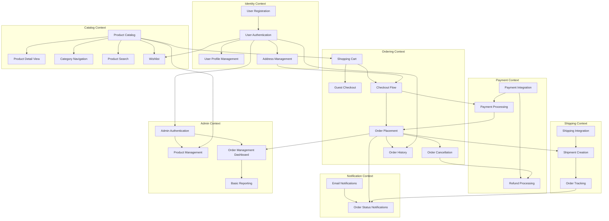

# Feature Roadmap

**Version:** `1.0` | **Status:** `Approved`  
**Date:** `2025-12-31`  
**Source:** PRD v1.1 (Decision-Complete)

---

## Overview

This roadmap defines the complete feature surface for the **itsme.fashion** premium beauty ecommerce platform. Features are organized by bounded context and listed with explicit dependencies.

All features are derived from the approved PRD and resolved product decisions.

---

## Bounded Context Mapping

| Bounded Context | Features |
| --------------- | -------- |
| **identity** | User Registration, User Authentication, User Profile Management, Address Management |
| **catalog** | Product Catalog, Product Detail View, Category Navigation, Product Search, Wishlist |
| **ordering** | Shopping Cart, Guest Checkout, Checkout Flow, Order Placement, Order Cancellation, Order History |
| **payment** | Payment Integration, Payment Processing, Refund Processing |
| **shipping** | Shipping Integration, Shipment Creation, Order Tracking |
| **notification** | Email Notifications, Order Status Notifications |
| **admin** | Admin Authentication, Product Management, Order Management Dashboard, Basic Reporting |

---

## Feature List

### Identity Context

- **User Registration**
  - Description: Allow new users to create an account with email and password.
  - Depends on: None (foundational)

- **User Authentication**
  - Description: Enable users to sign in and sign out securely via Firebase Auth.
  - Depends on: User Registration

- **User Profile Management**
  - Description: Allow authenticated users to view and update their profile information.
  - Depends on: User Authentication

- **Address Management**
  - Description: Enable users to add, edit, and delete shipping addresses.
  - Depends on: User Authentication

---

### Catalog Context

- **Product Catalog**
  - Description: Display a browsable list of beauty products with images, prices, and ethical markers.
  - Depends on: None (foundational)

- **Product Detail View**
  - Description: Show comprehensive product information including ingredients, usage tips, and ethical certifications.
  - Depends on: Product Catalog

- **Category Navigation**
  - Description: Allow users to browse products by category (Skin Care, Hair Care, Cosmetics).
  - Depends on: Product Catalog

- **Product Search**
  - Description: Enable users to search for products by name, ingredient, or category.
  - Depends on: Product Catalog

- **Wishlist**
  - Description: Allow authenticated users to save products for future purchase consideration.
  - Depends on: User Authentication, Product Catalog

---

### Ordering Context

- **Shopping Cart**
  - Description: Enable users to add, update, and remove products from a temporary cart with local storage persistence and server sync on authentication.
  - Depends on: Product Catalog

- **Guest Checkout**
  - Description: Allow unauthenticated users to complete purchases without registration, with post-purchase account creation offered.
  - Depends on: Shopping Cart

- **Checkout Flow**
  - Description: Guide users through address selection, shipping confirmation, and order review before payment.
  - Depends on: Shopping Cart, Address Management

- **Order Placement**
  - Description: Convert a cart into a confirmed order after successful payment, with inventory validation at checkout.
  - Depends on: Checkout Flow, Payment Processing

- **Order Cancellation**
  - Description: Allow customers to cancel orders anytime before shipment with automatic full refund.
  - Depends on: Order Placement, Refund Processing

- **Order History**
  - Description: Display a list of past orders with status and details for authenticated users.
  - Depends on: User Authentication, Order Placement

---

### Payment Context

- **Payment Integration**
  - Description: Integrate Cashfree payment gateway for secure payment processing.
  - Depends on: None (foundational)

- **Payment Processing**
  - Description: Process payments during checkout, preserving cart on failure without creating pending orders.
  - Depends on: Payment Integration, Checkout Flow

- **Refund Processing**
  - Description: Automatically process refunds for cancelled orders and partial fulfillment scenarios.
  - Depends on: Payment Integration, Order Cancellation

---

### Shipping Context

- **Shipping Integration**
  - Description: Integrate Shiprocket API for carrier services and shipment management.
  - Depends on: None (foundational)

- **Shipment Creation**
  - Description: Create shipments for confirmed orders with fixed-rate shipping cost calculation.
  - Depends on: Shipping Integration, Order Placement

- **Order Tracking**
  - Description: Provide basic order status updates (Placed → Shipped → Delivered) to customers.
  - Depends on: Shipment Creation

---

### Notification Context

- **Email Notifications**
  - Description: Send transactional emails for registration, order confirmation, and shipping updates.
  - Depends on: None (foundational)

- **Order Status Notifications**
  - Description: Notify customers of order status changes including cancellation confirmations and partial fulfillment alerts.
  - Depends on: Email Notifications, Order Placement, Order Tracking

---

### Admin Context

- **Admin Authentication**
  - Description: Secure admin access with role-based permissions separate from customer authentication.
  - Depends on: User Authentication

- **Product Management**
  - Description: Admin interface for creating, updating, and managing product catalog entries.
  - Depends on: Admin Authentication, Product Catalog

- **Order Management Dashboard**
  - Description: Admin view for monitoring and managing customer orders.
  - Depends on: Admin Authentication, Order Placement

- **Basic Reporting**
  - Description: Simple reports for order volume, revenue, and product performance.
  - Depends on: Admin Authentication, Order Management Dashboard

---

## Dependency Graph

---

## Execution Layers

Features are grouped into execution layers based on dependencies:

### Layer 1: Foundation
*No dependencies — can be built in parallel*

| Feature | Context |
| ------- | ------- |
| User Registration | identity |
| Product Catalog | catalog |
| Payment Integration | payment |
| Shipping Integration | shipping |
| Email Notifications | notification |

### Layer 2: Core Identity & Catalog
*Depends on Layer 1*

| Feature | Context |
| ------- | ------- |
| User Authentication | identity |
| Product Detail View | catalog |
| Category Navigation | catalog |
| Product Search | catalog |

### Layer 3: User Features & Cart
*Depends on Layer 2*

| Feature | Context |
| ------- | ------- |
| User Profile Management | identity |
| Address Management | identity |
| Shopping Cart | ordering |
| Wishlist | catalog |
| Admin Authentication | admin |

### Layer 4: Checkout & Payment
*Depends on Layer 3*

| Feature | Context |
| ------- | ------- |
| Guest Checkout | ordering |
| Checkout Flow | ordering |
| Payment Processing | payment |
| Product Management | admin |

### Layer 5: Order Fulfillment
*Depends on Layer 4*

| Feature | Context |
| ------- | ------- |
| Order Placement | ordering |
| Shipment Creation | shipping |
| Order Management Dashboard | admin |

### Layer 6: Post-Order
*Depends on Layer 5*

| Feature | Context |
| ------- | ------- |
| Order Cancellation | ordering |
| Order History | ordering |
| Order Tracking | shipping |
| Refund Processing | payment |
| Order Status Notifications | notification |
| Basic Reporting | admin |

---

## Summary

| Metric | Count |
| ------ | ----- |
| Total Features | 26 |
| Bounded Contexts | 7 |
| Execution Layers | 6 |
| Foundational Features | 5 |

---

## Approval

| Role | Status | Date |
| ---- | ------ | ---- |
| Product Owner | ✅ Approved | 2025-12-31 |
| Engineering Lead | ⏳ Pending | — |
| Design Lead | ⏳ Pending | — |